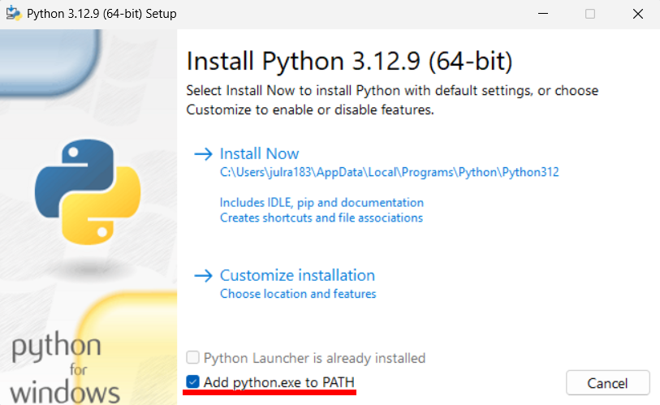

= Introduction
:hide-uri-scheme:
:imagesdir: documentation_images

This program was developed by Julius Ramshage as an amanuensis at 
the department of sociology and department for 
social work, during the autumn of 2024 and first quarter of 2025. 
The source code is available for free under the GPL v3 license 
on github at https://github.com/Bullbagaren/Coruse_review_anonymizer. 
Questions about the source code and bug reports can also be submitted on github.

== Installation
If you already have installed python 3.12 or know how to do it you may
skip the section on installing python. Python 3.12 is used due to a library conflict with Spacy
and a newer version of python at the time of writing. Use newer versions at your own risk.

IMPORTANT: The program need firefox to run so make sure it is installed before 
trying to run the program.

=== Installing python
To install Python head to the download page on the python website https://www.python.org/downloads/
Scroll down to _looking for a specific release_ and download _Python 3.12.x_. _x_ in this case 
refers to any sub-version of python 3.12. It should look something like this: 
image:python_download_edited.png[]

Once a version of python 3.12 is chosen, click on it and scroll down to the files section.
Click on _Windows installer (64-bit)_. The page should look like this:
image::CRA_/python_files_edited.png[]

In the description column it should say _Recommended_.
Once you have clicked on it it
should automatically download the file.
When the file is downloaded, head to the folder where
it is downloaded and run it. This should not
require admin privileges and follow the install instructions.
The window should look like this

IMPORTANT: make sure the checkbox with _Add python.exe to PATH_ is ticked in.

If the install it successful you should see this on your monitor

image:python_install3.png[]

You may now close it, and you can proceed to the next step.

== Downloading the script
To download the scrip you will need to fetch it from github at: 
https://github.com/Bullbagaren/Coruse_review_anonymizer. 

TIP: If you know how to use git, you can probably skip to the 
section for how to run the script.

Once there click on the green button labeled code,
a dropdown menu should appear and look something like this:
image:github_edited.png[]
Click on the download zip button on the bottom of the dropdown menu,
and save the zip archive to the location of your choosing.

If you have downloaded the file in your downloads folder make sure to move
it to a different location of your choosing when extracting
the contents of the folder. This is important because where you extract
the content will determine where you will run the program from.
So make sure you extract it to a place outside the downloads folder.

== Setting up the environment
Before we are ready to run the script some preparations are in order.
The program require some external libraries to function, to install
we first need to create a python virtual environment. To do
this we need to open the powershell, right click inside the folder
to open the dropdown menu you normally get from right clicking.
Select _open in terminal_ (swedish: Öppna i Terminal).
You should now have a black window open. In the black window
run the following command:

[source, powershell]
----
python -m venv .venv
----
This create a python virtual environment in the folder _.venv_
We only need to create the environment once (unless the folder
has been deleted for some reason). But everytime we need to
run the program the environment needs to be activated. This is
done by the following command
[source, powershell]
----
.\venv\Scripts\activate
----
_(.venv)_ should now appear on the left hand side of the terminal,
indicating that the environment is active. Now we are ready to install
the external libraries, this is done by the following command:

[source, powershell]
----
pip install -r requrements.txt
----
This will take a bit of time to run and should without fault install all 
required libraries. Once it's done we have one more command to run.
[source, powershell]
----
python -m spacy download sv_core_news_lg
----
This downloads the model which performs the named entity recognition
to find and censor names that appear in the reviews. 

You have now installed all the libraries needed to run the program. 

== Running the program
Before you try to run the program make sure that the virtual environment is activated. 
if you don't see _(.venv)_ in the left hand of the terminal window you can always
reactivate it with: 
[source, powershell]
----
.\venv\Scripts\activate
----
The libraries previously installed with still be installed, so nothing else should be required.
Then to run the program you can go ahead and run the command:
[source, powershell]
----
python main.py
----
It will prompt you for a username, password, and URL for the course review. 
The username is just your AKKA-id, and the password is the password used 
for your AKKA-id. The URL is the URL for reviews the course evaluations
for Uppsala university and will look something like this:

----
https://kv.uu.se/granska/140089
----

IMPORTANT: When typing in your password it will not echo back to you
This means that you will not see that you are typing.

Once you provided it with a valid AKKA-id, password and URL
the program will open a firefox window, it will not do much while the program
is running.

TIP: You can use the computer while the program is running, but if you start
experiencing issues, leave it until it is done and grab coffee instead whilst waiting.

When the program is finished it will enter the sanitised text into the web-browser
it opened. Now is when you have to manually check so that everything is correct.
When the program identifies what it considers a bad word it will tag it with

----
<ISSUE><ISSUE>
----
So in the web browser you can look for them with ctrl+f. When double checking if names
are censored, the program will output a list which is mostly empty, but which contains names.
if the list is completely empty it means it was unable to find any names,
although this is very unlikely. You can use ctrl+f just to check if it by accident missed
any names, as well as if some names that you don't recognize to be staff, is most
likely to be author names and needs correction. When you are happy with the changes you
can save and publish. It is important to know that it might sometimes say it failed to
save and publish. This is most likely because the instance of firefox is considered to
be a bot. To remedy this check your email for a a notice that it was indeed publish,
If so you can close down the browser and exit the program. If you did not receive an email,
you can just save the changes and then head over to the course review website and
manually publish the saved version.

IMPORTANT: You are most likely to get this error when letting the website be open for too 
long without any changes made. 

To make another sanitation round, exit the script and re-run it again. 

== Troubleshooting

=== Basic troubleshooting step

If the programs runs but can't change anything, i.e. it throws an error saying that
the URL must be wrong, first double check so the URL is correct, secondly make sure
you have the privileges to review and edit the course reviews. It
should also go without saying that you have doublechecked so that you have
correctly spelled your AKKA-id and password. If the issue still persists, move on
to the next step

Make sure that the virtual environment is activated. So remember to check
that it does in fact say (.venv) next to your username in the terminal (black window).

=== More advanced steps

Second step would be to make sure that it is not the python library spacy which is
causing issues with the version of python, or any other library for that matter of fact.
First step to try and resolve the issue is to repeat the step were we install the
libraries using the requirements.txt file. If the issue still persists, try installing
different versions of python, spacy during the development period of this
application proved to be temperamental depending on the version of python that
was used. If the issue still persists ask someone who knows more or open
an issue on github and please provide the full error message in any issue
that you decide to open.

